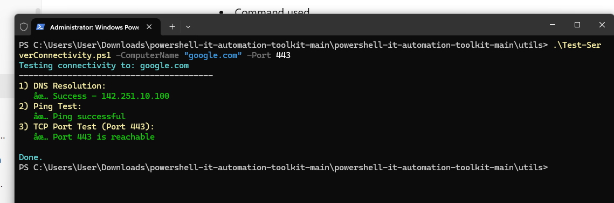

# PowerShell IT Automation Toolkit ⚙️

This repository contains **practical PowerShell scripts** used in day-to-day IT operations.

The focus is on:
- Reducing manual work
- Improving consistency
- Automating common administrative tasks

---

## 🧰 Areas Covered

- Active Directory user management
- User onboarding and offboarding
- Inventory and reporting
- Basic security and system checks
- Utility scripts for IT support teams

---

## 📁 Repository Structure

- `ad-user-management/` – Scripts for AD users and groups
- `inventory/` – Scripts for collecting system information
- `hardening/` – Basic security and configuration scripts
- `utils/` – Helper and troubleshooting scripts

---

## ⚠️ Notes

- Scripts are provided for **learning and demonstration**
- Always test in a lab environment before production use
- Scripts may require administrative privileges

## ✅ Verified Script Execution

The scripts in this repository have been tested successfully in a real Windows environment.

### Server Connectivity Test Example

This test validates:
- DNS resolution
- Network connectivity (ping)
- TCP port availability (e.g., HTTPS / RDP / SMB)
